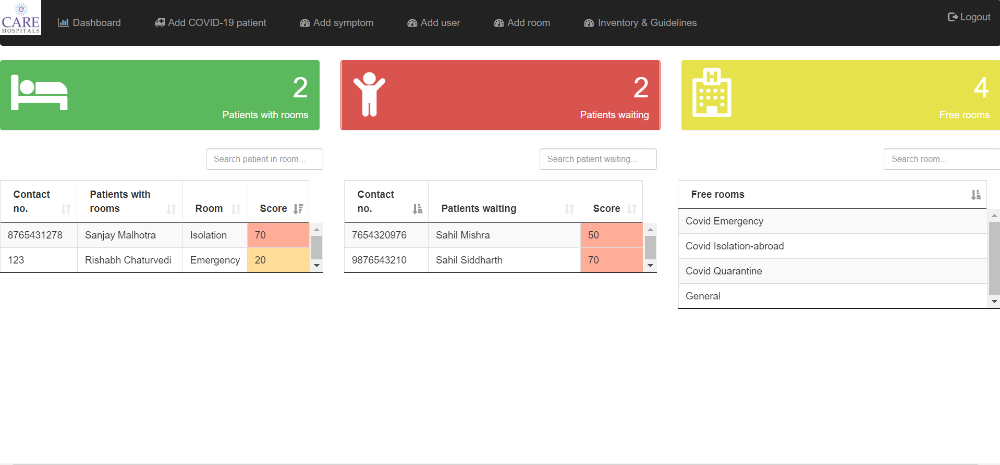
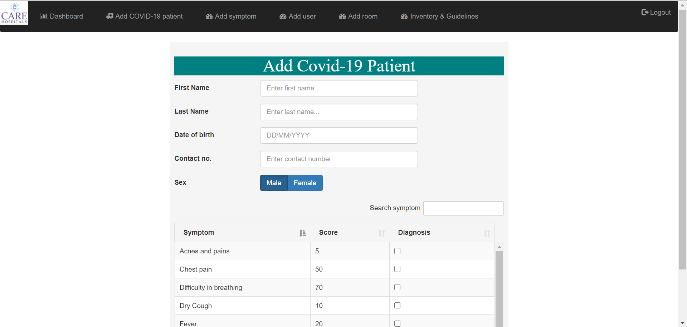
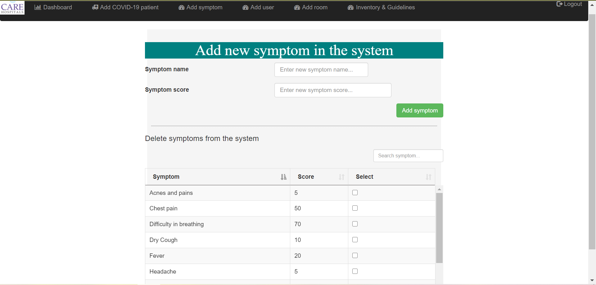
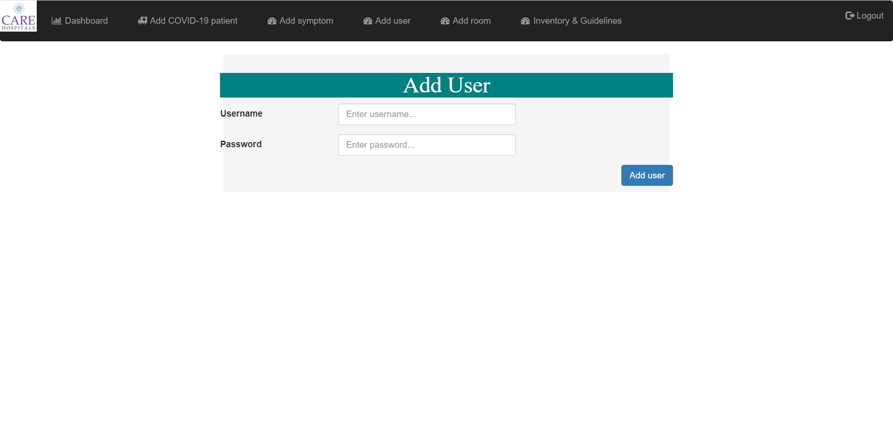
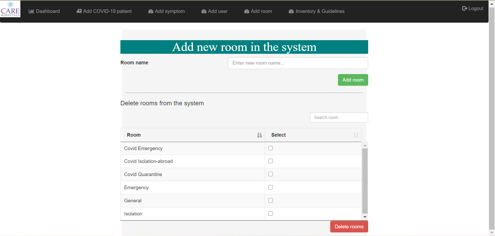
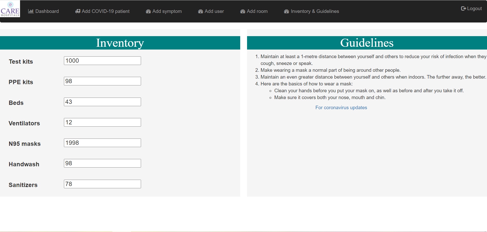
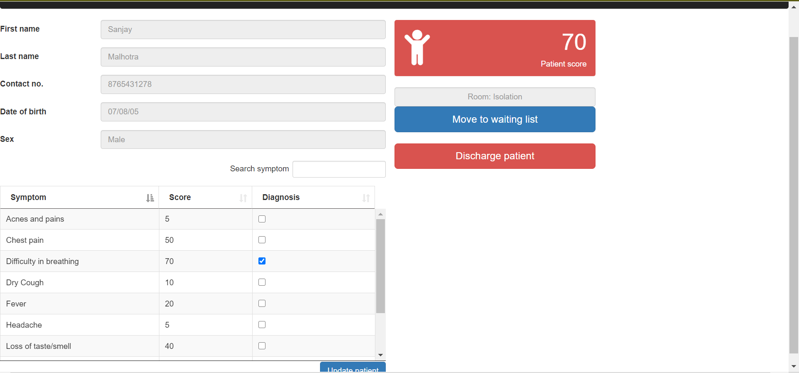

# Description 👈

The times being as they are of a global contagious pandemic, room and equipment management in a hospital is of utmost importance and that is what out Care Hospitals does. This application lets the hospitals to keep a check of their pateints, inventories and everything else.

It also allows the hospital staff to take special measures in case of a Covid-19 patient and to keep check of the things required in hospitals.It allows nurses to keep track of the patients and their covid symptoms in real time and to have an overview over the patients and rooms, and better manage the rooms assignment across patients. 

## Prerequisites

- Node.js 6.9.1 or later - install from https://nodejs.org/  
- MongoDB - download from https://www.mongodb.com/try/download/community

## Installing - easy 🔌

- Download the repository  
- git clone https://github.com/princygarg/CareH.git  
- Open the Terminal (Linux & MacOS) or PowerShell (Windows) and change directory to the project folder.  
- Type ‘npm install’ in the Terminal (PowerShell) and press Enter. All the dependencies would be installed.  
- Open MongoDB Compass.  
- Go back to the Terminal (PowerShell) and be sure that you are pointing inside the project folder. To open the application, type ‘node app.js’ and press Enter.  
- The application should be live on the local port 3000.  
- Type http://localhost:3000/ into a browser.  
- To login use the **Username: careH@staff** and **Password: 12345678**  
- Now you should be inside the application.  

## How to use it 📖
### Dashboard

Data about patients and rooms is available here. The page is split into three tables.  
The first table gives the details of the patients already with room.  
The second table shows patients waiting.  
The third table shows the rooms available.  
To allot room to any patient click on his name in the Waiting list and the room that you want to allocate.  
  
  

To clear the red warning sign you need to go on the patient’s personal page. To do that, you have to double click on his name. By clicking on the ‘Update button’ on the bottom of the page, the patient’s diagnosis in updated for the next 24 hours (consequently, the red warning sign disappears).

### Add Covid-19 patient page

You can add a new patient in the system with his personal details and his covid-19 symptoms. The application automatically computes the score of the patient based on the entered symptoms.

### Add symptom Page

Covid being a disease that is still under study therefore we added this option just in case someone with a new symptom tests positive for Covid-19.

### Add user name

With increasing number of cases the hospital staff needs to be expanded continuosly hence this option allows us to add a staff member.

### Add room

With the continuous increase in patients the hospitals need are continuously adapting new measures to overcome the shortage of beds and hence this option allows us to add rooms.

### Inventory & Guidelines

Here the hospital management can keep a check of the essentials like PPE kits, gloves, santizers, test kits and other things.  
Basic guidelines that one must keep in mind.

### Patient Page

On double clicking any patient from the dashboard his page will get open up where we can see his score, discharge him, move to waiting list and get his personal details.

## Technologies 
- **Backend** - Node Js ,Express.js
- **Frontend** - HTML, CSS, Bootstrap, jQuery
- **Database** - mongoDB
